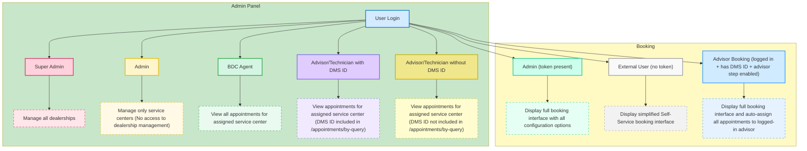

```mermaid
---
config:
  layout: dagre
---
flowchart TD
    subgraph subGraph0["Admin Panel"]
        SuperAdmin["Super Admin"]
        Entry["User Login"]
        Admin["Admin"]
        BDC["BDC Agent"]
        Advisor_TechnicianWithDMS["Advisor/Technician with DMS ID"]
        Advisor_TechnicianWithoutDMS["Advisor/Technician without DMS ID"]
        SuperAdminRights["Manage all dealerships"]
        AdminRights["Manage only service centers (No access to dealership management)"]
        BDCRights["View all appointments for assigned service center"]
        WithDMSRights["View appointments for assigned service center (DMS ID included in /appointments/by-query)"]
        WithoutDMSRights["View appointments for assigned service center (DMS ID not included in /appointments/by-query)"]
    end
    subgraph Booking["Booking"]
        AdminBooking["Admin (token present)"]
        ExternalUser["External User (no token)"]
        AdvisorBooking["Advisor Booking (logged in + has DMS ID + advisor step enabled)"]
        AdminBookingRights["Display full booking interface with all configuration options"]
        ExternalUserRights["Display simplified Self-Service booking interface"]
        AdvisorBookingRights["Display full booking interface and auto-assign all appointments to logged-in advisor"]
    end
    Entry --> SuperAdmin & Admin & BDC & Advisor_TechnicianWithDMS & Advisor_TechnicianWithoutDMS & AdminBooking & ExternalUser & AdvisorBooking
    SuperAdmin --> SuperAdminRights
    Admin --> AdminRights
    BDC --> BDCRights
    Advisor_TechnicianWithDMS --> WithDMSRights
    Advisor_TechnicianWithoutDMS --> WithoutDMSRights
    AdminBooking --> AdminBookingRights
    ExternalUser --> ExternalUserRights
    AdvisorBooking --> AdvisorBookingRights
    style SuperAdmin fill:#ffd1dc,stroke:#cc3366,stroke-width:2px
    style Entry fill:#d3eaff,stroke:#007acc,stroke-width:2px
    style Admin fill:#fff5cc,stroke:#e6b800,stroke-width:2px
    style BDC fill:#d5f5e3,stroke:#28a745,stroke-width:2px
    style Advisor_TechnicianWithDMS fill:#e0ccff,stroke:#7b68ee,stroke-width:2px
    style Advisor_TechnicianWithoutDMS fill:#f0e68c,stroke:#c0b000,stroke-width:2px
    style SuperAdminRights fill:#ffe6eb,stroke:#cc3366,stroke-dasharray: 5 5
    style AdminRights fill:#fff9e6,stroke:#e6b800,stroke-dasharray: 5 5
    style BDCRights fill:#eafaf1,stroke:#28a745,stroke-dasharray: 5 5
    style WithDMSRights fill:#f1eaff,stroke:#7b68ee,stroke-dasharray: 5 5
    style WithoutDMSRights fill:#fffdd0,stroke:#c0b000,stroke-dasharray: 5 5
    style AdminBooking fill:#ccffeb,stroke:#20c997,stroke-width:2px
    style ExternalUser fill:#f9f9f9,stroke:#999,stroke-width:2px
    style AdvisorBooking fill:#d0eaff,stroke:#3399ff,stroke-width:2px
    style AdminBookingRights fill:#e6fff5,stroke:#20c997,stroke-dasharray: 5 5
    style ExternalUserRights fill:#f2f2f2,stroke:#999,stroke-dasharray: 5 5
    style AdvisorBookingRights fill:#e6f2ff,stroke:#3399ff,stroke-dasharray: 5 5
    style Booking fill:#FFF9C4
    style subGraph0 fill:#C8E6C9

```